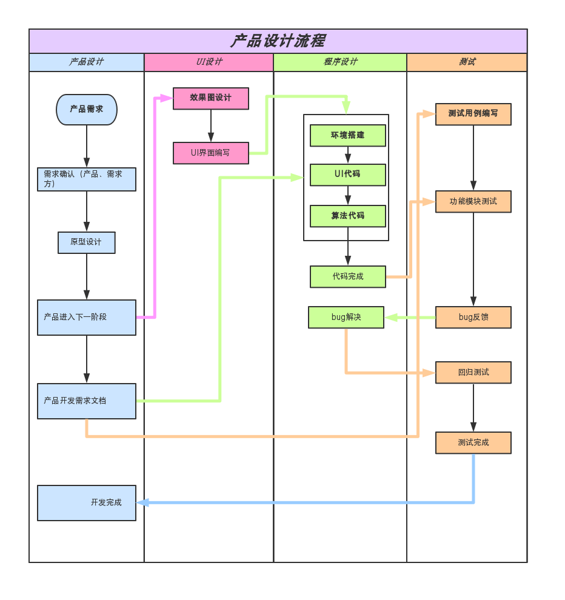

# **《基于实时视频分析的入侵监测系统》立项报告**

---

小组成员：董舜尧、郑栩僮、庞家耀、李高丞、马哲

指导老师：史华冬

时间：2019.7.2

---

[TOC]

---

## **1. 引言**

### **1.1) 编写目的**

编写此立项报告以明确项目立项内容和要求，明确人员分工与实现，并给出项目的基本设计流程和实现流程。

### **1.2) 系统简要信息**

基于实时的视频流,利用图像识别功能,自动检测视频中的运动物体。包括后端，数据处理和前端 web 页面实时显示结果, 同时支持异常图像上传至云服务器,有一定账户管理系统，可以配合手机 APP 、微信推送，实现全方位，实时监控的目的。

控制系统： Raspberry Pi 3

信息采集： Pi camera，支持红外功能

语言和框架：Python、Java、Vue.js

### **1.3) 定义**

基于实时视频分析有一定账户管理系统并基于内网的家庭、中小型企业等保密环境入侵监测系统。

### **1.4) 参考资料**

a. 华为云平台任务指导手册

b. U+新工科智慧云

c. Vue.js 文档

d. OpenCV 文档

---

## **2．主要内容及基本要求**

### **2.1) 对项目的基本要求**

a. 使用 Raspberry Pi 运行环境配置 OpenCV

b. 移动物体检测——高斯模糊功能

c. 移动物体检测——背景移除功能

d. 移动物体检测——物体标注功能

e. 图像分类、存储功能

f. 心跳监测功能

g. Web Socket 服务端程序设计

h. 账号管理功能

i. 报警系统

j. 直播系统

### **2.2) 此项目的主要目标**

a. 基于实时的视频流,利用图像识别功能,自动检测视频中的运动物体。

b. 后端数据处理和前端 web 页面实时显示结果。

c. 实现基本账户管理功能和报警系统。

### **2.3) 给出的条件、假定、限制**

背景：基于实时视频分析有一定账户管理系统并基于内网的家庭、中小型企业等保密环境入侵监测系统。

要求：实现入侵报警、入侵照片采集，项目要求需要使用高斯模糊功能、背景移除功能、物体标注功能和 Web Socket 服务端程序设计。

适用范围：简单的安全监控场所，如门卫、无人仓库等。由于项目闭环的设计，能很好的在涉密的环境内网运行。

### **2.4) 技术基础及相应的市场分析**

技术基础：OpenCV 环境对于运动物体检测和背景移除、物体提取功能已经十分成熟，网络有十分丰富的样本模板，Raspberry Pi 可以实现远程控制和视频数据传输，数据计算模块 numpy 可以实现数据计算，Web Socket 服务端程序设计可以实现实时数据传输。总体来说技术层面上可行。

市场分析：现如今人们对于隐私安全的需求十分迫切，我们的入侵报警系统有很大的市场前景，深度图像处理框架也是现如今热门方向，加入人脸识别系统，结合其他的智能产品，实现高度自动化的物联网自动化运行环境。可以广泛应用在小区入侵监测,智能家居的安防,老人智能看护等领域。总体来说有很好的市场前景。

---

## **3．项目的设计及实现** 

### **3.1) 流程**

#### **a. 设计流程**：

 

#### **b. 实现流程：**

 

### **3.2) 工作分配**

| **成员** | **具体工作**               |
| -------- | -------------------------- |
| 董舜尧   | 项目经理、服务器后端开发   |
| 郑栩僮   | 主架构设计、服务器后端开发 |
| 庞家耀   | Pi 端数据分析处理           |
| 李高丞   | 前端设计与开发             |
| 马哲     | 文档设计与管理、代码辅助   |

 

### **3.3) 费用开支**

电源适配器：输出电压 5v ，电流 1A 或 2A

Micro USB 线一条

带排线的高清摄像头 1 个

容量为 16GB 的 SD 卡 1 个，读卡器一个

高清线及 VGA 转换口(可选）

显示屏一个、键盘一个

（注：以上材料均为学院提供，实际开支为 0 ）

### **3.4) 人员结构**

 

| **项目经理** | 董舜尧 |
| ------------ | ------ |
| **主架构**   | 郑栩僮 |
| **开发人员** | 庞家耀 |
| **开发人员** | 李高丞 |
| **管理人员** | 马哲   |

 

### **3.5) 设备情况**

显示屏一台

键盘一个

转接线和数据线若干条

SD 卡一个

高清摄像头一个

树莓派微型电脑一个

### **3.6) 局限性**

设备局限性：由于只有一台显示屏一个树莓派微型电脑，导致树莓派方面不可多线设计代码，工程速度有下降。

程序局限性：由于技术实力和项目时间问题导致只能实现基本的入侵物体识别，高级的人脸识别不能实现。

---

## **4. 运行设计**

### **4.1) 项目时间总体规划**

| **时间** | **预期工作**                                                 |
| -------- | ------------------------------------------------------------ |
| 第1~2天  | Raspberry Pi 环境配置、OpenCV 环境配置、摄像头配置、人员分工和文档书写 |
| 第3天    | 初期检查、技术学习                                           |
| 第4~7天  | 各成员代码书写                                               |
| 第7天    | 中期项目检查                                                 |
| 第8~9天  | 代码测试和 bug 修改、文档书写                                  |
| 第10天   | 项目答辩                                                     |

 

### **4.2) 进度分段标准**

进度大致如 4.1 所述，具体代码完成进度由各成员自己把控并每天上传代码现阶段成果。

### **4.3) 阶段考核方法**

代码上传华为云平台由实训老师检查验收。

---

## **5. 项目验收** 

### **5.1) 项目验收方式**

a.每天上传代码至华为云平台由实训老师检查

b.第十天最终答辩，附带答辩 PPT 和文档

### **5.2) 提交内容清单**

a.代码仓库的每日代码记录

b.最终答辩PPT

c.项目文档

d.项目源码

### **5.3) 后续工作情况**

小组成员各自进行实训总结，并互相交流。

---

## **6. 总结**

本次实训项目为《基于实时视频分析的入侵监测系统》，分析得技术方面可行，市场前景广大，无需开支（由学院负担），小组成员经讨论后已有完整项目规划和任务分工，预计可以在要求工期内完成，项目可行。