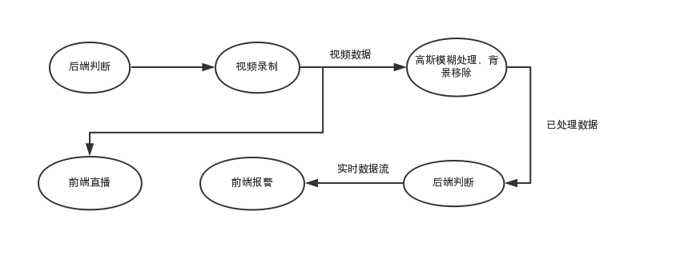
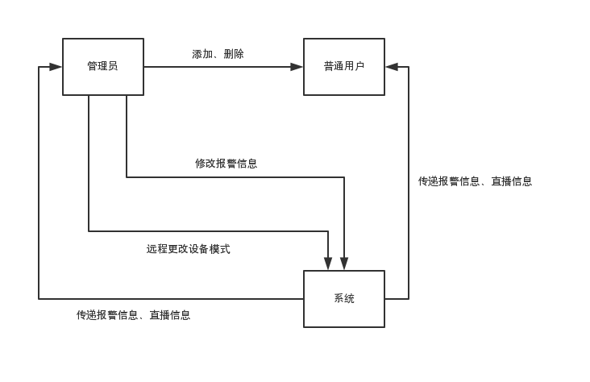
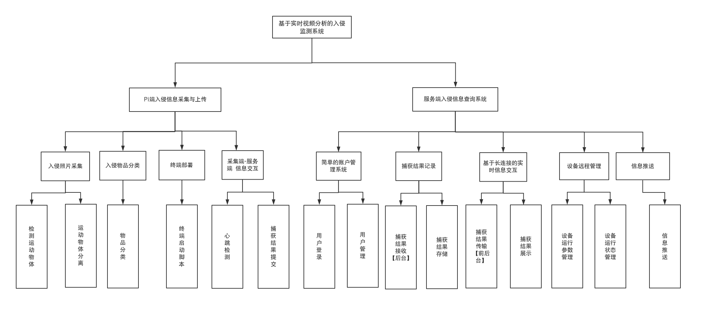

# **《基于实时视频分析的入侵监测系统》需求规格说明书**

---
小组成员：董舜尧、郑栩僮、庞家耀、李高丞、马哲

指导老师：史华冬

时间：2019.7.2

---

[TOC]

---

## **1. 引言**

### **1.1) 系统参考文献**

a. 华为云平台任务指导手册

b. U+ 新工科智慧云

c. Vue.js 文档

d. OpenCV 文档

### **1.2) 整体描述**

系统名称：《基于实时视频分析的入侵监测系统》

控制系统： Raspberry Pi3

信息采集： Pi camera ，支持红外功能

语言和框架：Python、OpenCV 、Java、Vue.js

---

## **2. 信息描述**

### **2.1) 信息内容表示**

可能用到的数据：

a. 摄像头视频数据

b. 高斯模糊处理数据

c. 背景帧数据

d. 用户操作数据

可能用到的接口：

a. Java/Python socket 接收数据信息

b. Web socket 构建服务器以实现实时连接

c. Vue 构建客户端网页程序

### **2.2) 信息流**

#### **2.2.1 数据流**：

 

#### **2.2.2 控制流**：

 

## **3. 功能描述**

### **3.1) 功能划分**

### **3.2) 功能描述**

PI端：

检测运动物体，运用高斯模糊技术、背景移除技术、物体标注技术检测入侵者并分类、截图，并传输视频和图像信息。

服务器后端：

处理接收的信息，记录捕获结果，捕获结果判断，服务器端与客户端实时连接，传输报警信息。

用户前端：

用户界面有登录功能，具有管理员账户和用户账户，管理员可添加、删除普通用户，并可远程更改报警信息和设备模式，获取服务器和pi端数据并向所有用户提供报警功能等。

### **3.3) 控制描述**

#### **3.3.1) 控制规约**

开发语言：Python、Java

开发框架：前端（Vue.js）

开发工具：PyCharm、Visual Stdio Code、IntelliJ IDEA

#### **3.3.1) 设计规约**

a. 要求多项任务并行

b. 有一定代码规范以便后期合并

---

## **4. 行为描述**

### **4.1) 系统状态**

状态1：关闭

​    电源未开启或程序未开启

状态2：中止

​    管理员远程中止程序

状态3：启动中

​    程序正在启动中

状态4：运行中

​    程序正常运行

### **4.2) 事件和动作**

a. 开启：程序启动

b. 直播：视频信息实时传输

c. 中止：管理员远程中止程序

d. 报警：发现入侵，实时远程报警

---

## **5. 校验和校准**

### **5.1) 性能范围**

可实现运动物体检测并报警，能够发现并截图标记运动物体，根据运动物体进行分类。

### **5.2) 基本测试方案**

由小组成员多次试验，场景定为教室室内，采取人员和物体交替进入场景，多次测试以检验程序运行准确性和稳定性。

### **5.3) 系统的期望目标**

a. 稳定实现入侵者提取和报警

b. 系统准确性高

c. 系统能够在正常状态下稳定运行

### **5.4) 特殊的考虑**

如时间允许尝试进行人脸识别技术，并对不同人脸进行分类，提高安全性。

 